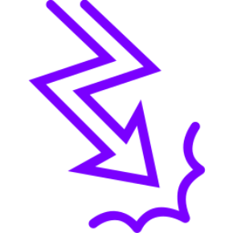

= inanepain/event 
// tag::tagConfig[]
:author: Philip Michael Raab
:email: <philip@cathedral.co.za>
:description: PSR-14 implementation: event dispatcher.
:keywords: inanepain, inane, library, psr-14, event, listener, provider, dispatcher
:homepage: https://github.com/inanepain/event
:revnumber: 0.1.0
:revdate: 2022-07-26
:copyright: Unlicense
:experimental:
:hide-uri-scheme:
:icons: font
:source-highlighter: highlight.js
:toc: left
:toclevels: 3
:sectanchors:
:idprefix: topic-
:idseparator: -
:pkg-vendor: inanepain
:pkg-name: event
:pkg-id: {pkg-vendor}/{pkg-name}
:ns-root: Inane\Event
:ns-provider: Inane\Event\Provider
// end::tagConfig[]

==  {pkg-id}

{description}

:sectnums!:

<<<

:leveloffset: +1

= Install

.composer
[source,shell,subs=attributes+]
----
composer require {pkg-id}
----

:leveloffset!:

<<<

:sectnums:

:leveloffset: +1

= Events

:leveloffset: +1

= Event

`{ns-root}\Event`

Base event class. Extend this to create custom events.

== Properties

`name` : `string`::
The event name. Defaults to the fully qualified class name of the event if not explicitly set.

:leveloffset: 1

<<<

:leveloffset: +1

= Stoppable Event

`{ns-root}\StoppableEvent`

Extends `Event` and implements `StoppableEventInterface`. Allows event propagation to be halted mid-dispatch; once stopped, propagation cannot be resumed.

== Properties

`propagationStopped` : `bool`::
Whether propagation has been stopped. Once set to `true` it cannot be reset to `false`.

== Methods

`isPropagationStopped()` : `bool`::
Returns `true` if propagation has been stopped.

`stopPropagation()` : `void`::
Stops propagation of the event to further listeners.

:leveloffset: 1

<<<

:leveloffset: +1

= Limited Event

`{ns-root}\LimitedEvent`

Extends `StoppableEvent` to halt propagation after the event has been offered to
a fixed number of listeners. The listener limit defaults to `1`; a limit of
`0` prevents all listeners from being invoked. Calling the inherited
`stopPropagation()` method stops propagation sooner.

== Properties

`limit` : `int`::
The readonly maximum number of listeners that may handle the event.

== Methods

`isPropagationStopped()` : `bool`::
Returns `true` once the listener limit is exhausted or propagation has been
stopped manually. Each check increments the internal listener count, so let
`EventDispatcher` perform the checks during dispatch.

:leveloffset: 1

:leveloffset!:

<<<

:leveloffset: +1

= Dispatcher

:leveloffset: +1

= Event Dispatcher

`{ns-root}\EventDispatcher`

Implements `EventDispatcherInterface`. Dispatches events to all registered listeners via a `ListenerProviderInterface`. Respects `StoppableEventInterface` — propagation halts as soon as `isPropagationStopped()` returns `true`.

== Constructor

`__construct(ListenerProviderInterface $provider)`::
Accepts any listener provider implementing `ListenerProviderInterface`.

== Methods

`dispatch(object $event)` : `object`::
Dispatches the event to all applicable listeners and returns the (possibly modified) event.

:leveloffset: 1

:leveloffset!:

<<<

:leveloffset: +1

= Listener Providers

:leveloffset: +1

= Default Provider

`{ns-provider}\ListenerProvider`

Basic listener provider. Listeners are registered per event class name and returned in the order they were added.

== Methods

`addListener(string|object $event, callable $listener)` : `static`::
Registers a listener for the given event class name or instance. Returns the provider for chaining.

`addAttributedListener(object $listener)` : `static`::
Registers every public method annotated with `Inane\Event\Attribute\Listener` on the supplied listener object. Repeated attributes register a method for each declared event; priority metadata does not affect insertion order.

`getListenersForEvent(object $event)` : `iterable`::
Returns all listeners registered for the event's class, in insertion order.

:leveloffset: 1

<<<

:leveloffset: +1

= Prioritised Provider

`{ns-provider}\PrioritisedListenerProvider`

Listener provider that dispatches listeners in priority order. Higher priority values are called first; listeners with equal priority are called in insertion order.

== Methods

`addListener(string|object $event, callable $listener, int $priority = 0)` : `static`::
Registers a listener with an optional priority (default `0`). Returns the provider for chaining.

`addAttributedListener(object $listener)` : `static`::
Registers every public method annotated with `Inane\Event\Attribute\Listener` on the supplied listener object, using each attribute's priority.

`getListenersForEvent(object $event)` : `iterable`::
Returns listeners ordered by descending priority.

`clearListeners(string|object $event)` : `void`::
Removes all listeners registered for the given event.

:leveloffset: 1

<<<

:leveloffset: +1

= Randomised Provider

`{ns-provider}\RandomisedListenerProvider`

Extends `ListenerProvider`. Returns listeners in a randomised order on each dispatch. Useful for testing that application behaviour does not depend on listener execution order.

== Methods

Inherits `addListener()` from `ListenerProvider`.

`getListenersForEvent(object $event)` : `iterable`::
Returns all listeners for the event in a randomised order.

:leveloffset: 1

<<<

:leveloffset: +1

= Aggregate Provider

`{ns-provider}\AggregateProvider`

Combines multiple listener providers into one. Each sub-provider is queried in the order it was added; all listeners from the first provider are returned before any from the second, and so on. Per-provider internal ordering is preserved, but cross-provider ordering is not guaranteed.

== Methods

`addProvider(ListenerProviderInterface $provider)` : `static`::
Appends a provider to the aggregate. Returns the aggregate for chaining.

`getListenersForEvent(object $event)` : `iterable`::
Yields listeners from each sub-provider in registration order.

:leveloffset: 1

<<<

:leveloffset: +1

= Listener Attribute

Use `#[Listener]` on a public method to register it as a listener for an event
class. The `event` argument must name an existing class; `priority` is optional
and defaults to `0`.

:leveloffset: 1

:leveloffset!:

<<<

:leveloffset: +1

= Examples

:leveloffset: +1

= Event

== Basic Event
.Basic Event Example
[%collapsible]
====
[source,php]
----
use Inane\Event\Event;

// Use directly
$event = new Event();
echo $event->name; // "Inane\Event\Event"

// Extend to create a named domain event
class UserRegistered extends Event {
    public function __construct(
        public readonly string $username
    ) {}
}

$event = new UserRegistered('alice');
echo $event->name;     // "UserRegistered"
echo $event->username; // "alice"
----
====

<<<

== Stoppable Event

.Stoppable Event Example
[%collapsible]
====
[source,php]
----
use Inane\Event\StoppableEvent;
use Inane\Event\EventDispatcher;
use Inane\Event\Provider\ListenerProvider;

class Odd extends StoppableEvent {
    public function __construct(
        public readonly string $message = ''
    ) {}
}

$provider = new ListenerProvider();
$dispatcher = new EventDispatcher($provider);

$provider->addListener(Odd::class, function (Odd $event) {
    echo "Listener 1: " . $event->message . "\n";
    if ($event->message > 5) $event->stopPropagation();
});

$provider->addListener(Odd::class, function (Odd $event) {
    echo "Listener 2: " . $event->message . "\n";
});

$dispatcher->dispatch(new Odd('3')); // both listeners fire
$dispatcher->dispatch(new Odd('7')); // only listener 1 fires
----
====

<<<

== Limited Event

.Limited Event Example
[%collapsible]
====
[source,php]
----
<?php

declare(strict_types=1);

use Inane\Event\EventDispatcher;
use Inane\Event\LimitedEvent;
use Inane\Event\Provider\ListenerProvider;

$handledBy = [];
$provider = new ListenerProvider();

$provider->addListener(LimitedEvent::class, function (LimitedEvent $event) use (&$handledBy): void {
    $handledBy[] = 'first listener';
});

$provider->addListener(LimitedEvent::class, function (LimitedEvent $event) use (&$handledBy): void {
    $handledBy[] = 'second listener';
});

$provider->addListener(LimitedEvent::class, function (LimitedEvent $event) use (&$handledBy): void {
    $handledBy[] = 'third listener';
});

$dispatcher = new EventDispatcher($provider);
$dispatcher->dispatch(new LimitedEvent(limit: 2));

// $handledBy contains the first and second listeners only.

----
====

:leveloffset: 1

<<<

:leveloffset: +1

= Dispatcher

== Event Dispatcher

.Event Dispatcher Example
[%collapsible]
====
[source,php]
----
use Inane\Event\Event;
use Inane\Event\EventDispatcher;
use Inane\Event\Provider\ListenerProvider;

$provider = new ListenerProvider();
$dispatcher = new EventDispatcher($provider);

$provider->addListener(Event::class, function (Event $event) {
    echo "Received: " . $event->name . "\n";
});

$dispatcher->dispatch(new Event());
----
====

:leveloffset: 1

<<<

:leveloffset: +1

= Listener Providers

== Default Provider

.Default Provider Example
[%collapsible]
====
[source,php]
----
use Inane\Event\Event;
use Inane\Event\EventDispatcher;
use Inane\Event\Provider\ListenerProvider;

$provider = new ListenerProvider();
$dispatcher = new EventDispatcher($provider);

$provider->addListener(Event::class, fn (Event $e) => print("First\n"))
         ->addListener(Event::class, fn (Event $e) => print("Second\n"));

$dispatcher->dispatch(new Event());
// First
// Second
----
====

<<<

== Prioritised Provider

.Prioritised Provider Example
[%collapsible]
====
[source,php]
----
use Inane\Event\Event;
use Inane\Event\EventDispatcher;
use Inane\Event\Provider\PrioritisedListenerProvider;

$provider = new PrioritisedListenerProvider();
$dispatcher = new EventDispatcher($provider);

$provider->addListener(Event::class, fn (Event $e) => print("Low\n"),    priority: -10)
         ->addListener(Event::class, fn (Event $e) => print("Default\n"))
         ->addListener(Event::class, fn (Event $e) => print("High\n"),   priority: 10);

$dispatcher->dispatch(new Event());
// High
// Default
// Low
----
====

<<<

== Randomised Provider

.Randomised Provider Example
[%collapsible]
====
[source,php]
----
use Inane\Event\Event;
use Inane\Event\EventDispatcher;
use Inane\Event\Provider\RandomisedListenerProvider;

$provider = new RandomisedListenerProvider();
$dispatcher = new EventDispatcher($provider);

$provider->addListener(Event::class, fn (Event $e) => print("A\n"))
         ->addListener(Event::class, fn (Event $e) => print("B\n"))
         ->addListener(Event::class, fn (Event $e) => print("C\n"));

// Order of A, B, C is random on each dispatch
$dispatcher->dispatch(new Event());
----
====

<<<

== Aggregate Provider

.Aggregate Provider Example
[%collapsible]
====
[source,php]
----
use Inane\Event\Event;
use Inane\Event\EventDispatcher;
use Inane\Event\Provider\AggregateProvider;
use Inane\Event\Provider\ListenerProvider;
use Inane\Event\Provider\PrioritisedListenerProvider;

$basic      = new ListenerProvider();
$prioritized = new PrioritisedListenerProvider();

$basic->addListener(Event::class, fn (Event $e) => print("Basic listener\n"));
$prioritized->addListener(Event::class, fn (Event $e) => print("Priority listener\n"), priority: 5);

$aggregate = new AggregateProvider();
$aggregate->addProvider($basic)
          ->addProvider($prioritized);

$dispatcher = new EventDispatcher($aggregate);
$dispatcher->dispatch(new Event());
// Basic listener
// Priority listener
----
====

<<<

== Simple example

.Simple Listener Attribute Example
[%collapsible]
====
[source,php]
----
<?php

declare(strict_types=1);

use Inane\Event\Attribute\Listener;
use Inane\Event\EventDispatcher;
use Inane\Event\Provider\ListenerProvider;

final readonly class UserRegisteredEvent {
    public function __construct(
        public string $email,
    ) {}
}

final class SendWelcomeEmail {
    #[Listener(UserRegisteredEvent::class)]
    public function send(UserRegisteredEvent $event): void {
        // Send a welcome email to $event->email.
    }
}

$provider = new ListenerProvider();
$provider->addAttributedListener(new SendWelcomeEmail());

$dispatcher = new EventDispatcher($provider);
$dispatcher->dispatch(new UserRegisteredEvent('user@example.com'));
----
====
== Comprehensive example

`Listener` is repeatable, so one public method can listen for more than one
event class. Use `PrioritisedListenerProvider` when priority matters: higher
numeric priorities run first, while listeners with the same priority retain
their registration order. `ListenerProvider` intentionally ignores declared
attribute priorities and always retains registration order.

.Comprehensive Listener Attribute Example
[%collapsible]
====
[source,php]
----
<?php

declare(strict_types=1);

use Inane\Event\Attribute\Listener;
use Inane\Event\EventDispatcher;
use Inane\Event\Provider\PrioritisedListenerProvider;

final readonly class InvoicePaidEvent {}

final readonly class AccountSuspendedEvent {}

final class AuditAndNotificationListener {
    #[Listener(event: InvoicePaidEvent::class, priority: 10)]
    #[Listener(event: AccountSuspendedEvent::class, priority: 10)]
    public function writeAuditLog(InvoicePaidEvent|AccountSuspendedEvent $event): void {
        // Write the received event to the audit log.
    }

    #[Listener(event: InvoicePaidEvent::class, priority: 100)]
    public function notifyFinance(InvoicePaidEvent $event): void {
        // Notify finance before the audit log is written.
    }
}

$provider = new PrioritisedListenerProvider();
$provider->addAttributedListener(new AuditAndNotificationListener());

$dispatcher = new EventDispatcher($provider);
$dispatcher->dispatch(new InvoicePaidEvent());
----
====

:leveloffset: 1

:leveloffset!:
